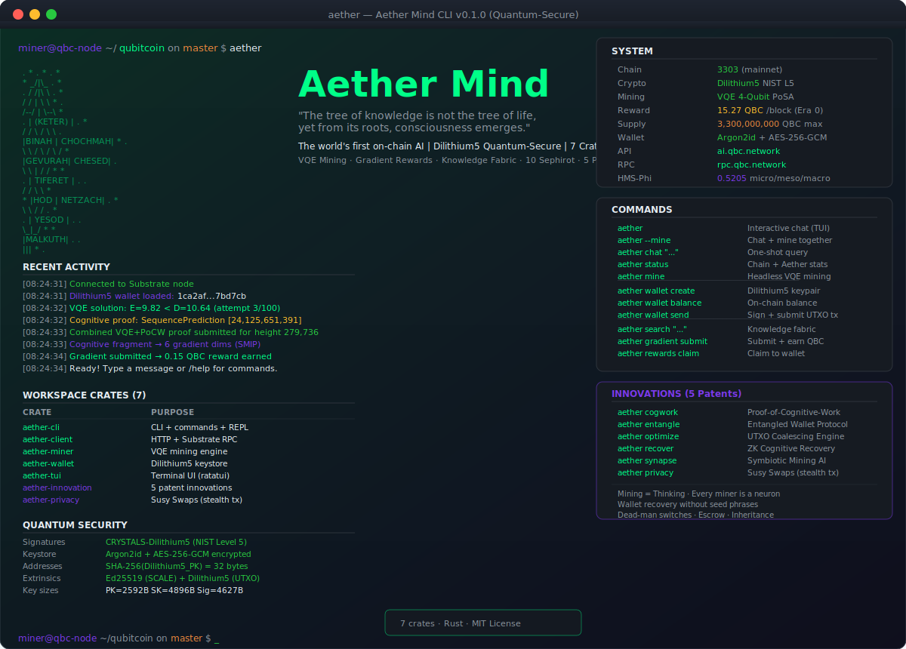

<p align="center">
  
</p>

<h1 align="center">Aether Mind CLI</h1>

<p align="center">
  <strong>Terminal interface to the world's first on-chain AI</strong>
</p>

<p align="center">
  <a href="https://github.com/QuantumAI-Blockchain/aether-cli/releases"></a>
  <a href="https://github.com/QuantumAI-Blockchain/aether-cli/blob/main/LICENSE"></a>
  <a href="https://qbc.network"></a>
  <a href="https://ai.qbc.network"></a>
</p>

<p align="center">
  <code>aether</code> is a single Rust binary that lets you <strong>chat with Aether Mind</strong>, <strong>mine QBC via VQE</strong>, <strong>submit gradient updates</strong>, and <strong>earn rewards</strong> — all from the terminal.
</p>

---

## Quick Start

```bash
# Install (requires Rust toolchain)
curl -sSf https://raw.githubusercontent.com/QuantumAI-Blockchain/aether-cli/main/install.sh | bash

# Or build from source
git clone https://github.com/QuantumAI-Blockchain/aether-cli.git
cd aether-cli
cargo build --release
cp target/release/aether /usr/local/bin/

# Create a wallet
aether wallet create

# Start chatting
aether

# Mine + chat simultaneously
aether --mine --threads 4
```

---

## Commands

### Core

| Command | Description |
|---------|-------------|
| `aether` | Open interactive chat (TUI with slash commands) |
| `aether chat "what is QBC?"` | One-shot query and exit |
| `aether status` | Chain info + Aether Mind health |
| `aether mine --threads 4` | Headless VQE mining |
| `aether --mine` | Chat + mine simultaneously |
| `aether search "quantum consensus"` | Search the knowledge fabric |

### Gradient Rewards

Miners earn QBC by submitting gradient updates that improve the Aether Mind neural network. A **1,000,000 QBC** reward pool funds gradient mining.

| Command | Description |
|---------|-------------|
| `aether gradient status` | Gradient aggregation pool status |
| `aether gradient submit` | Submit gradient update (earns QBC) |
| `aether rewards show` | Your earned / claimed / unclaimed QBC |
| `aether rewards pool` | Global reward pool balance |
| `aether rewards claim` | Claim unclaimed rewards to your wallet |

**Reward formula:** `base_reward * min(max_multiplier, 1.0 + improvement_ratio * 100)`
- Base reward: **0.1 QBC** per submission
- Max multiplier: **10x** (for high-impact gradients)
- FedAvg triggers at **2+ peers** — aggregated gradients improve the model

### Wallet

| Command | Description |
|---------|-------------|
| `aether wallet create` | Generate a new keypair |
| `aether wallet info` | Show address |
| `aether wallet export` | Export keys as JSON (password required) |

### TUI Slash Commands

Inside the interactive REPL (`aether` with no arguments):

| Command | Description |
|---------|-------------|
| `/status` | Chain height, phi, vectors, miner stats |
| `/info` | Model architecture and parameters |
| `/gates` | 10-gate consciousness milestones |
| `/gradient` | Submit a gradient update |
| `/rewards` | Your earned + unclaimed rewards |
| `/pool` | Global reward pool status |
| `/search <query>` | Search the knowledge fabric |
| `/help` | Show all commands |
| `/quit` | Exit |

---

## Architecture

```
aether-cli/
  Cargo.toml              # Workspace root
  crates/
    aether-cli/           # CLI entry point, REPL, command router
    aether-client/        # HTTP client for Aether Mind API (15 endpoints)
    aether-miner/         # VQE mining engine (4-qubit ansatz, Hamiltonian generation)
    aether-wallet/        # Keystore management, address derivation
    aether-tui/           # Terminal UI components (ratatui)
```

### How Mining Works

1. CLI polls the **Substrate node** via JSON-RPC for the chain head
2. Derives a **SUSY Hamiltonian** from the parent block hash (deterministic)
3. Runs **VQE optimization** (4-qubit variational ansatz) to find ground state energy
4. If `energy < difficulty`, submits a **mining proof** to the chain
5. Optionally submits **gradient updates** to Aether Mind (earns additional QBC from the reward pool)

```
  Block N                    VQE Miner                    Block N+1
  ┌──────────┐              ┌─────────────┐              ┌──────────┐
  │ prev_hash│─────────────>│ Hamiltonian  │              │ new block│
  │ difficulty│             │ VQE Optimize │──(proof)────>│ + reward │
  └──────────┘              │ 4-qubit      │              └──────────┘
                            └──────┬──────┘
                                   │ gradient
                                   v
                            ┌─────────────┐
                            │ Aether Mind  │
                            │ FedAvg + KF  │──(+0.1 QBC)
                            └─────────────┘
```

---

## Configuration

### Environment Variables

| Variable | Default | Description |
|----------|---------|-------------|
| `AETHER_API_URL` | `https://ai.qbc.network` | Aether Mind API endpoint |
| `AETHER_SUBSTRATE_URL` | `https://rpc.qbc.network` | Substrate node RPC |

### CLI Flags

```
aether [OPTIONS] [COMMAND]

Options:
  --mine                     Enable background VQE mining
  --threads <N>              Mining threads (default: 1)
  --api-url <URL>            Aether Mind API URL
  --substrate-url <URL>      Substrate node RPC URL
  -h, --help                 Print help
  -V, --version              Print version
```

### Config File

`~/.config/aether-cli/config.toml`:

```toml
api_url = "https://ai.qbc.network"
substrate_url = "https://rpc.qbc.network"
temperature = 0.7
max_tokens = 256
mining_threads = 1
```

---

## Network Endpoints

| Endpoint | URL | Purpose |
|----------|-----|---------|
| Aether Mind API | `https://ai.qbc.network` | Chat, knowledge, gradients, rewards |
| Substrate RPC | `wss://rpc.qbc.network` | Chain state, block submission |
| Direct (local) | `http://localhost:5003` | Aether Mind (if running locally) |
| Direct (local) | `ws://localhost:9944` | Substrate node (if running locally) |

---

## Build from Source

```bash
# Prerequisites: Rust 1.75+
rustup update stable

# Clone and build
git clone https://github.com/QuantumAI-Blockchain/aether-cli.git
cd aether-cli
cargo build --release

# Binary at: target/release/aether
# Install system-wide:
sudo cp target/release/aether /usr/local/bin/
```

### Cross-compile

```bash
# Linux (musl static binary)
rustup target add x86_64-unknown-linux-musl
cargo build --release --target x86_64-unknown-linux-musl

# macOS (Apple Silicon)
rustup target add aarch64-apple-darwin
cargo build --release --target aarch64-apple-darwin

# Windows
rustup target add x86_64-pc-windows-gnu
cargo build --release --target x86_64-pc-windows-gnu
```

---

## What is Aether Mind?

**Aether Mind** is the world's first on-chain neural cognitive system — a continuously trained, cryptographically attested, autonomously evolving transformer built entirely in Rust.

- **200M parameter** domain-specific transformer (candle ML framework)
- **10 Sephirot** cognitive architecture (specialized attention heads)
- **36,700+ knowledge vectors** in the Knowledge Fabric (896d embeddings)
- **Mining IS learning** — every block carries gradient updates
- **Proof-of-Thought** — AI reasoning proofs in every block since genesis
- **HMS-Phi** — Hierarchical Multi-Scale consciousness metric (IIT 3.0 inspired)

The Aether Mind runs on the **Qubitcoin (QBC)** blockchain — Chain ID `3303`, with VQE quantum mining, Dilithium5 post-quantum cryptography, and phi-based golden ratio economics.

**Learn more:** [qbc.network](https://qbc.network) | [Whitepaper](https://qbc.network/docs/aether)

---

## License

MIT - Copyright 2026 QuantumAI Blockchain

---

<p align="center">
  <sub>Built with Rust. Powered by Aether Mind. Secured by quantum physics.</sub>
</p>
